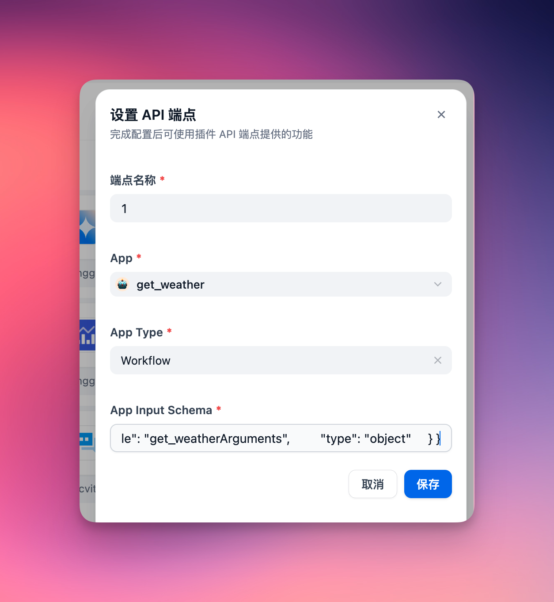
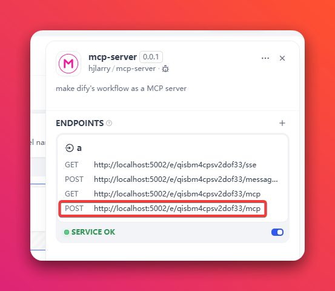
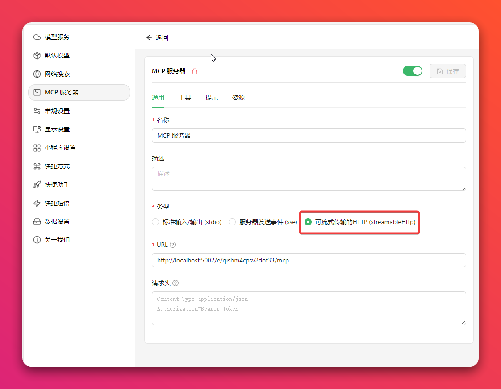
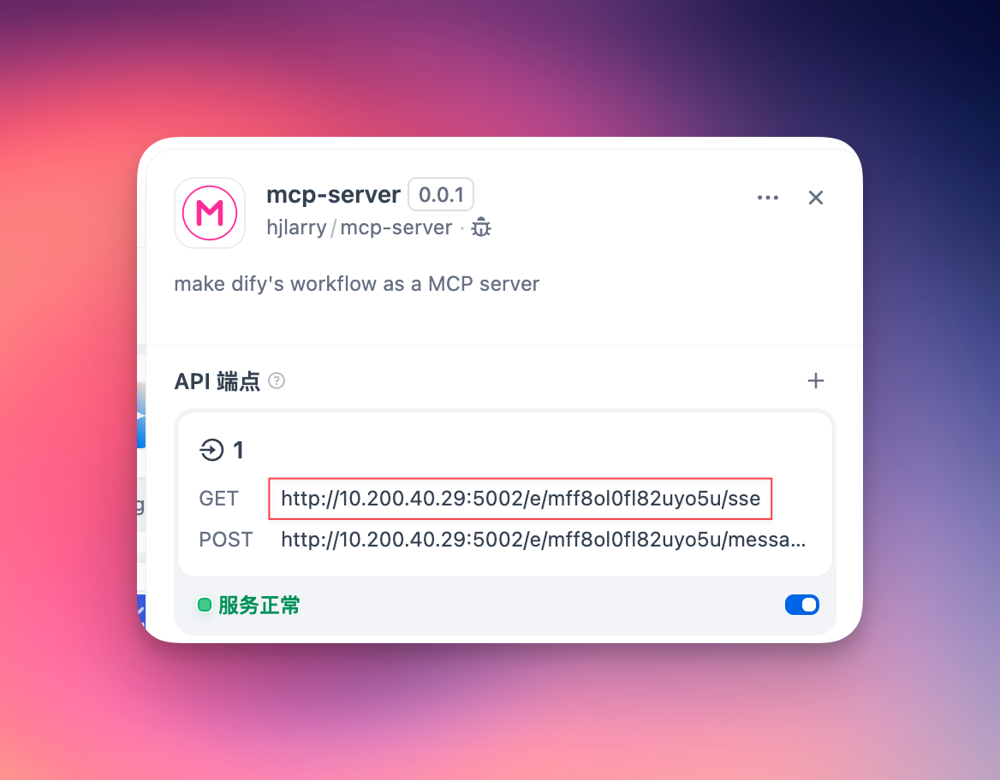
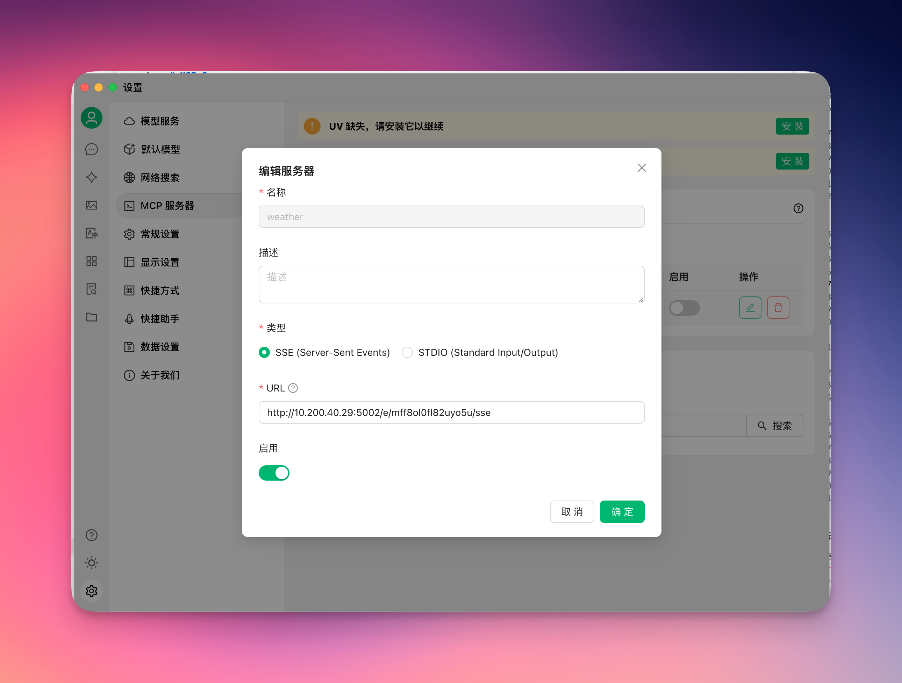
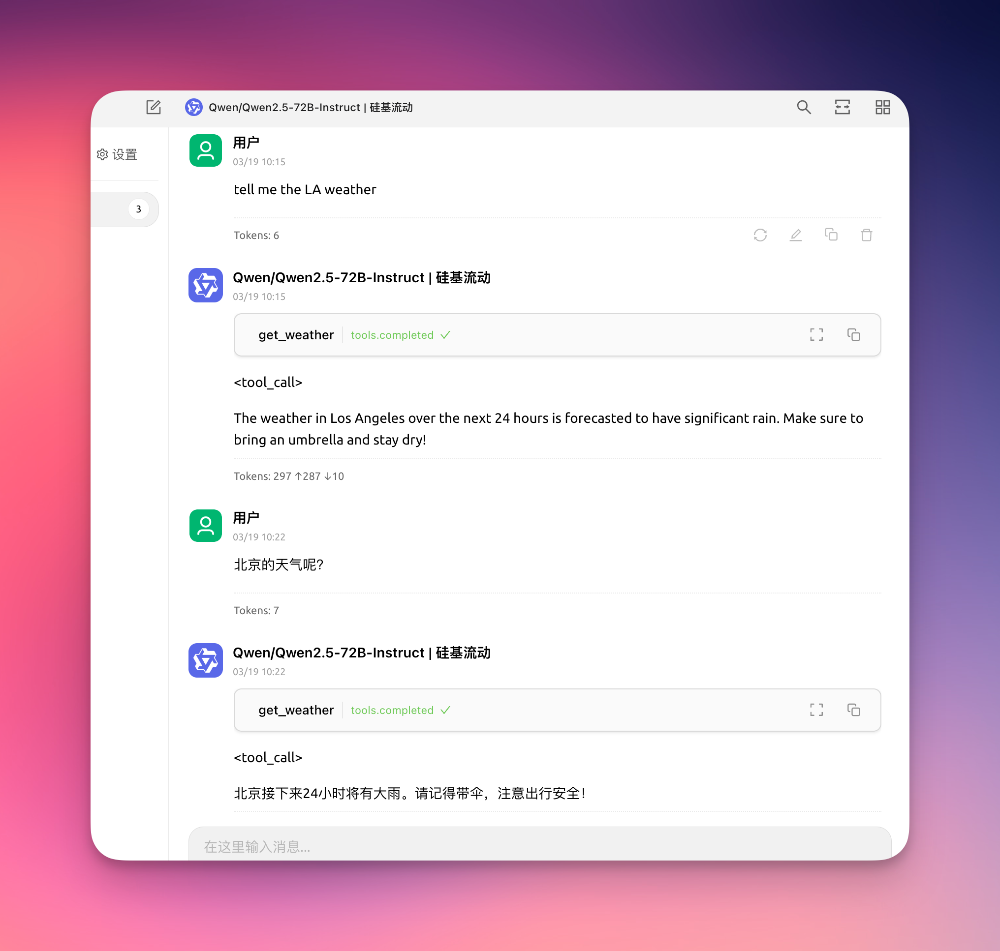

# MCP Server

**Author:** hjlarry  
**Version:** 0.0.4  
**Type:** extension   
**Repo:** [https://github.com/hjlarry/dify-plugin-mcp_server](https://github.com/hjlarry/dify-plugin-mcp_server)  
**Feature Request:** [issues](https://github.com/hjlarry/dify-plugin-mcp_server/issues)  


A Dify endpoint plugin that change a dify app to a mcp server.

**To keep your data secure, use this plugin exclusively within your private network.**

## Get Started

### 1. create a simple workflow app in dify.


### 2. add a endpoint and select this app.


The app's input schema must define its input parameters. For a chat dify app, ensure to include a `query` field in the input schema, formatted as follows:
```json
{
    "name": "get_weather",
    "description": "Get weather status for a place.",
    "inputSchema": {
        "properties": {
            "place": {"title": "Place", "type": "string"}
        },
        "required": ["place"],
        "title": "get_weatherArguments",
        "type": "object"
    }
}
```

### 3. copy the endpoint url to your mcp client, like `Cherry Studio`

#### Option 1: Use the newest Streamable HTTP protocol (Recommended)



#### Option 2: Use the legacy SSE protocol



### 4. enjoy it!


### 5. To keep your data secure, you can add a `Auth Bearer Token` on the endpoint setting.

For example, if your `Auth Bearer Token` is setting to `sk-abcdefgh`, then the request header of MCP client must add `Authorization: Bearer sk-abcdefgh`


## Changelog

### 0.0.4
- Add response to the `ping` method of MCP client, some clients use this method to check server health 
- Add `Authorization: Bearer` token validator
- Fix some [log](https://github.com/hjlarry/dify-plugin-mcp_server/pull/35) incorrect 

### 0.0.3
- To fix sse get non-exist key get lots error logs on the plugin daemon.
- Add logs to help debug problems.
- Streamable http support response object and array.

### 0.0.2
- Add a new Streamable HTTP protocol.
- Update dify-plugin-sdk version.